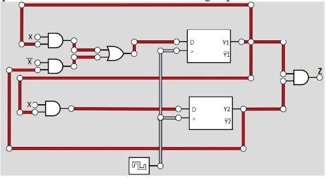

## Question 1

### Find logical expression and the state table for the following sequential circuit


$Z=(XY_1 + X'Y_2)(XY_1)$

| Present state | Next State  |   Output    |
| :-----------: | :---------: | :---------: |
|   $Y_1Y_2$    | $X=0, ~X=1$ | $X=0, ~X=1$ |
|     $0~0$     |    $0~1$    |    $0~1$    |
|     $0~1$     |    $0~1$    |    $0~1$    |
|     $1~0$     |    $0~1$    |    $0~1$    |
|     $1~1$     |    $0~1$    |    $0~1$    |

---

## Question 2
### Using JK-FF, develop a 3 bit circular counter starting/ending at 000, where each state transition results in one bit being changed. NOTE: You are to make a counter, be wise with your state transitions.]

#### a) Derive the state diagram
```
000    ->    001    ->    010    ->    011


100    ->    101    ->    110    ->    111
```

#### b) Derive the state transition table


#### c) K-maps


#### d) Draw the circuits


---

## Question #3

### Design a sequence detector that can detect 0101using D-FF.Sequence detector outputs one if a pattern appears in the input bit stream and shows zero as output otherwise.

#### a) Develop state table
#### b) Develop state diagram
#### c) Develop expressions for the flip flops inputs (simply using k-map)
#### d) Develop the circuit

---

## Question 4

### Assume the initial status of below circuit is ABC=000. What is the status after three clocks?


> **ABC=110**
